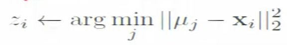

# Kmean_map_reduce Java Project README

## Introduction
Welcome to the Kmean_map_reduce Java project! This project focuses on implementing both sequential and parallel versions of the K-means clustering algorithm. K-means is a popular unsupervised machine learning algorithm used for clustering similar data points into groups. This project provides implementations for both the sequential and parallel versions of the algorithm, enabling you to understand and compare their performances in different scenarios.

## Project Structure
The project is organized into the following structure:

```
├───src
    ├───Parallel_Kmeans_algorithm
    │   ├───KMeansMapper.java
    │   └───KMeansReducer.java
    ├───Sequance_KMeans_Algorithm
    │    ├───Centroid.java
    │    ├───Coordinates.java
    │    ├───Distance.java (interface)
    │    ├───EuclideanDistance.java
    │    ├───Kmeans.java
    │    ├───Point.java
    │    └───Main.java
    └───resources
```

### Part I: Sequential K-means Algorithm
In the `Sequance_KMeans_Algorithm` package, you'll find the implementation for the sequential version of the K-means algorithm. This part of the project focuses on a single-threaded approach to clustering data points.

- `Centroid.java`: Represents the centroid of a cluster.
- `Coordinates.java`: Defines the coordinates of a data point.
- `Distance.java`: Interface defining the contract for calculating distance between points.
- `EuclideanDistance.java`: Implementation of the Distance interface, calculating Euclidean distance between points.
- `Kmeans.java`: Implements the sequential K-means algorithm.
- `Point.java`: Represents a data point.
- `Main.java`: Entry point of the sequential K-means algorithm implementation.

### Part II: Parallel K-means Algorithm using Map Reduce
In the `Parallel_Kmeans_algorithm` package, you'll find the implementation for the parallel version of the K-means algorithm using Map Reduce. This part of the project focuses on parallelizing the clustering process for big data analysis.

** Classify **

Assign observation to the closest cluster center



- `KMeansMapper.java`: Mapper class for the Map Reduce job, responsible for mapping input data to key-value pairs.
    For each data point,given ({Ui}, xi)

** Recenter **

Revise cluster center as mean fo assigned observations.


- `KMeansReducer.java`: Reducer class for the Map Reduce job, responsible for reducing and clustering data points.
  
### Additional Resources
The `resources` directory can be used to store any additional resources or configuration files needed for the project.

## How to Run
To run the sequential K-means algorithm, execute the `Main.java` file in the `Sequance_KMeans_Algorithm` package.

To run the parallel K-means algorithm using Map Reduce, you need to set up a Hadoop cluster. Once the cluster is set up, compile the code and create a JAR file. Then, submit the JAR file to the Hadoop cluster for execution.

## Dependencies
- Java Development Kit (JDK): Ensure you have JDK installed on your system.
- Apache Hadoop: Required for running the parallel version of the algorithm using Map Reduce. Set up a Hadoop cluster to execute the Map Reduce job.

## Conclusion
This project provides a comprehensive implementation of both sequential and parallel versions of the K-means clustering algorithm. You can explore the code, analyze the implementations, and run the algorithms to understand their behavior and performance. Happy clustering!
